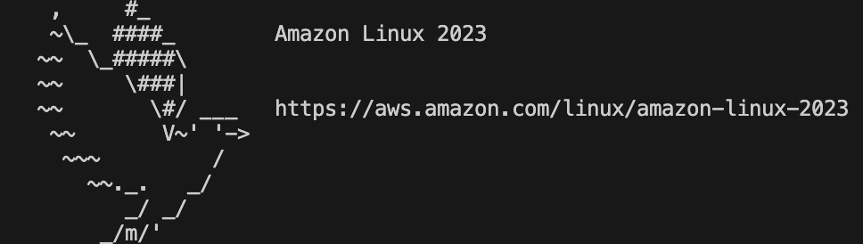

# Section 1. EC2

## インスタンス作成

東京リージョンに変更


EC2を開く


インスタンス（実行中）をクリック


インスタンスを起動をクリック


`{受講生名}-training-ec2-server` というふうに、インスタンス名を入力する。


OSイメージなどはデフォルトでOK


インスタンスタイプもデフォルトでOK


新しいキーペアの作成をクリック


キーペア名を、 `{受講生名}-training-ec2-key` とする。他はデフォルト設定のまま、キーペアを作成 ボタンをクリック


**重要**

`{受講生名}-training-ec2-key.pem` という受講生名のファイルがダウンロードされる。後ほど、使うので、保管しておくこと。


ネットワーク設定にて、SSH、HTTP、HTTPS の箇所全てにチェックを入れる。


```
# 注意
信元が 0.0.0.0/0 のルールを指定すると、すべての IP アドレスからインスタンスにアクセスすることが許可されてしまうため、実務では望ましい選択ではない。（社内の特定のネットワークからしかSSH接続できないようにするなどが望ましいケースが多い。）
今回は、研修での使用であることや、受講生のWifi環境がバラバラであるため、デフォルト設定のままとしている。
```

30GiBにする


```
EBSボリュームとは: 
EBS（Elastic Block Store）ボリュームは、EC2インスタンスにアタッチされるストレージのことです。EC2インスタンスが停止してもデータは保持され、再起動してもアクセス可能な状態を維持できます。EC2の「ハードディスク」に相当するものと考えるとわかりやすいです。
```


最後に インスタンスを起動 ボタンをクリックする。


正常にインスタンスを作成できたら、すべてのインスタンスを表示をクリック


EC2インスタンスが作成できたことを確認。

インスタンスIDのリンクをクリックし、 `パブリック IPv4 DNS` をコピーしておく。（後ほど、SSH接続する際に仕様する。）


## SSH接続

現在のディレクトリに、先ほどダウンロードしたpemファイルを配置し、以下のコマンドを実行する（受講生名の部分は適宜変更すること）

```sh
# mv コマンド: ファイルを指定のディレクトリに移動
mv {受講生名}-training-ec2-key.pem ~/.ssh/

# ユーザーディレクトリ配下の ssh フォルダ（隠しフォルダ）を確認
ls ~/.ssh/

# 秘密鍵のパーミッションを修正
chmod 600 ~/.ssh/{受講生名}-training-ec2-key.pem
```


SSH接続のコマンドを実行(受講生名と、パブリック IP は、適宜変更すること)
```sh
# ssh 接続
ssh -i ~/.ssh/{受講生名}-training-ec2-key.pem ec2-user@{先ほどコピーした パブリック IPv4 DNS}
```


`Are you sure you want to continue connecting (yes/no/[fingerprint])?` と聞かれたら yes と入力してエンター。

以下のような表示になれば、EC2サーバーにSSH接続ができている。



## EC2サーバーに触れてみる
基本的に、WSLで作成した Linux 環境と同じことができますが、vim という Linuxに標準搭載されているエディタを使用して、ファイル編集を行うことができます。

EC2インスタンス内でhello.pyというファイルを作成し、print("Hello World")を実行してみましょう


1. hello.pyファイルを作成する
まず、touchコマンドを使って空のhello.pyファイルを作成します。

```sh
touch hello.py
```

2. vimを使ってファイルに内容を追加する
次に、vimエディタを使ってファイルに print("Hello World") を追加します。

```sh
vim hello.py
```

3. vim内での操作
vimが開いたら、 `iキー` を押して挿入モードに入ります。挿入モードになったら、以下のコードを書きます。

```python
print("Hello World")

```

入力が終わったら、 `Escキー` を押して挿入モードを終了します。

`shift + :wq` と入力してエンターキーを押すことで、ファイルを保存してvimを終了します。

4. ファイルの変更の確認と実行

cat コマンドでファイルの中身を確認
```sh
cat helllo.py
```

pythonファイルとして実行
```sh
python3 hello.py
```

動作確認が終わったら、以下のコマンドで、`hello.py` を削除しておきましょう。

```sh
# 現在のディレクトリにあるファイルを確認
ls

# rm コマンド : ファイルを削除
rm hello.py

# 現在のディレクトリにあるファイルを確認
ls
```

## 【注意】 鍵ファイルは取り扱い注意!!

鍵ファイルは、外部流出に注意！Gitにあげたり、オープンな場に公開することは、厳禁！


## 演習

- 課題
    - `EC2サーバー構築 → pemファイル作成 → SSH 接続 → python ファイル をvim で作成・実行` までを実行してましょう。
- 前提
    - EC2インスタンス名 : **受講生名-staging-ec2-server**
    - pemファイル名 : **受講生名-staging-ec2-key.pem**
- 注意
    - 基本的な設定は変更せず、EC2インスタンス名とpemファイル名だけ変えて、行うこと
    - 特に EC2インスタンスのスペックは `t2.micro から 絶対に変更しない` こと！

※ 商用アプリ開発では、stagingを検証環境、productionを本番環境として扱う。

※ 今回の研修では、本番環境・検証環境という概念はないが、受講生が作成した Django アプリをデプロイする環境を便宜的に staging 環境とする。
