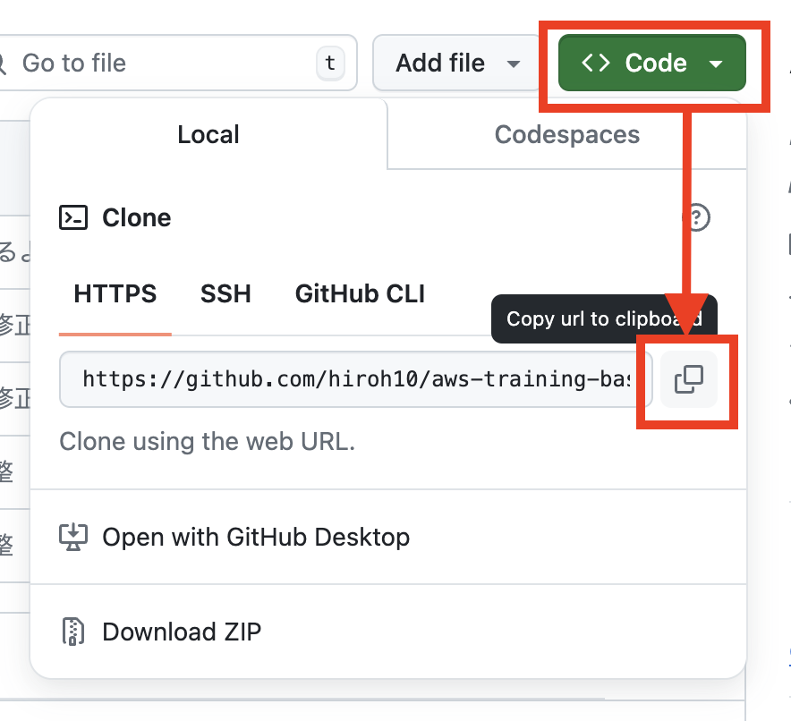
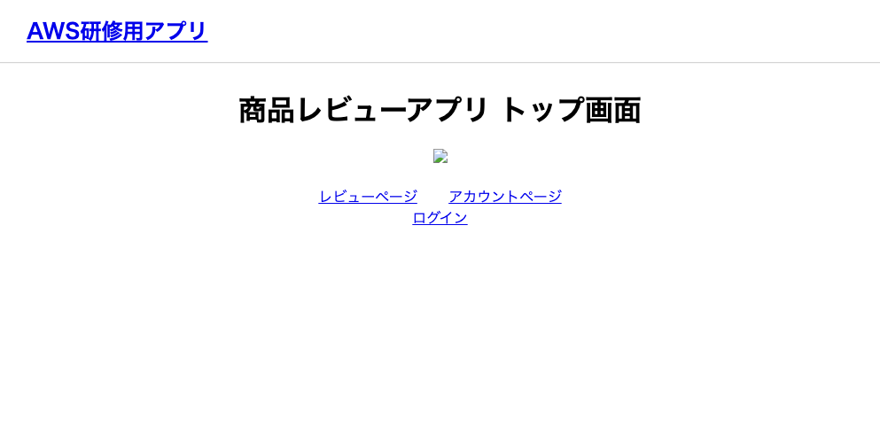

# Section 2. デプロイ

## ローカル環境での準備

### nginx/nginx.conf

myproject 配下に `nginx/nginx.conf` を作成
```sh
mkdir nginx
touch nginx/nginx.conf
```

nginx.conf には、パブリック IPv4 アドレスの箇所を各自修正して、以下のように記載

```txt
# グローバル設定
user  nginx;
worker_processes  auto;
error_log  /var/log/nginx/error.log warn;
pid        /var/run/nginx.pid;

# 'events' セクション
events {
    worker_connections  1024;
}

# 'http' セクション
http {
    include       /etc/nginx/mime.types;
    default_type  application/octet-stream;

    log_format  main  '$remote_addr - $remote_user [$time_local] "$request" '
                      '$status $body_bytes_sent "$http_referer" '
                      '"$http_user_agent" "$http_x_forwarded_for"';

    access_log  /var/log/nginx/access.log  main;

    sendfile        on;
    keepalive_timeout  65;

    include /etc/nginx/conf.d/*.conf;

    server {
        listen 80;
        server_name {パブリック IPv4 アドレス};
        client_max_body_size 10g;

        location /static {
            alias /usr/share/nginx/html/static;
        }

        location /media {
            alias /usr/share/nginx/html/media;
        }

        location / {
            proxy_pass http://app:8000;
            proxy_set_header X-Forwarded-For $proxy_add_x_forwarded_for;
            proxy_set_header Host $http_host;
            proxy_redirect off;
            proxy_set_header X-Forwarded-Proto $scheme;
        }
    }
}

```

### settings.py - ALLOWED_HOSTS
config/settings.py の ALLOWED_HOSTS に、パブリック IPv4 アドレス を追加する

```py
ALLOWED_HOSTS = [
    'localhost',
    '{パブリック IPv4 アドレス}',  # パブリック IPv4 アドレスを追加
]
```

### settings.py - 静的ファイル

config/settings.py の STATICFILES_DIRS の上に、`STATIC_ROOT` のコードを追加

▼修正前
```py
STATICFILES_DIRS = (
    os.path.join(BASE_DIR, "staticfiles"),
)
```

▼修正後
```py
STATIC_ROOT = '/usr/share/nginx/html/static/' # Nginxで静的ファイルを配信するために追加

STATICFILES_DIRS = (
    os.path.join(BASE_DIR, "staticfiles"),
)
```

### docker-compose-staging.yml
docker-compose.yml と同じ階層に、`docker-compose-staging.yml` を作成する。

```sh
touch docker-compose-staging.yml
```

ファイルを作成したら、コードは以下のようにしておく。

```yml
version: '3.8'

services:
  db:
    image: postgres:latest
    environment:
      POSTGRES_USER: 'postgres'
      POSTGRES_PASSWORD: 'postgres'
      POSTGRES_DB: 'postgres'
    ports:
      - 5433:5432
    hostname: postgres_aws
    restart: always
    volumes:
      - postgres_data_aws:/var/lib/postgresql/data
    healthcheck:
      test: ["CMD-SHELL", "pg_isready -U postgres"]
      interval: 10s
      timeout: 5s
      retries: 5

  app:
    image: django:latest
    build: .
    command: gunicorn config.wsgi:application --bind 0.0.0.0:8000
    restart: always
    volumes:
      - .:/code
      - static_volume:/usr/share/nginx/html/static
    expose:
      - "8000"
    depends_on:
      db:
        condition: service_healthy

  nginx:
    image: nginx:latest
    ports:
      - "80:80"
    volumes:
      - ./nginx/nginx.conf:/etc/nginx/nginx.conf
      - static_volume:/usr/share/nginx/html/static
    depends_on:
      - app

volumes:
  postgres_data_aws:
  static_volume:

```

### requirements.txt
requirements.txt に以下の記述を追加
```txt
gunicorn==23.0.0
python-dotenv==1.0.1
```

### git にプッシュ

変更をGitにプッシュしておく


## EC2の設定

始めに、ssh接続をしておく。
```sh
ssh -i ~/.ssh/{受講生名}-training-ec2-key.pem ec2-user@{パブリック IPv4 DNS}
```

### Git

EC2にGitをインストールし、リポジトリをクローンします。
```sh
# Gitのインストール
sudo yum update -y
sudo yum install git -y

# リポジトリをクローン(リポジトリから HTTPS URL をコピーする)
# 例： git clone https://github.com/your-username/your-repository.git
git clone {リポジトリからコピーした HTTP URL}

# クローンしたディレクトリに移動
cd aws-training-{受講生名}
```



### Docker
```sh
# Dockerのインストール
sudo yum update -y
sudo yum -y install docker
```

```sh
# Dockerデーモンを起動
sudo systemctl start docker
sudo systemctl enable docker
```

```sh
# dockerのバージョンを確認
docker --version
```

```sh
sudo curl -L "https://github.com/docker/compose/releases/download/v2.29.2/docker-compose-$(uname -s)-$(uname -m)" -o /usr/local/bin/docker-compose

# 上記コマンドでうまくいかない場合は、以下のコマンドを使用
# sudo curl -L "https://github.com/docker/compose/releases/latest/download/docker-compose-$(uname -s)-$(uname -m)" -o /usr/local/bin/docker-compose


sudo chmod +x /usr/local/bin/docker-compose

docker-compose version
```

docker-compose.yml などがある階層に移動する
```sh
# 移動
cd myproject
# ファイル一覧を確認
ls
```

Dockerイメージのビルドとコンテナ起動
```sh
# Dockerイメージのビルド
sudo docker-compose -f docker-compose-staging.yml build

# Dockerコンテナをバックグラウンドで起動
sudo docker-compose -f docker-compose-staging.yml up -d

# 起動したコンテナを確認
sudo docker ps

# (必要に応じて)起動していないコンテナも含めて確認
sudo docker ps -a
```

### DBにデータ投入

現時点で、EC2インスタンスのパブリック IPv4 アドレスをブラウザに貼り付けると、デプロイしたサイトにアクセスすることができるが、商品一覧ページなど、データベースに関わるページを開くと、エラーとなる。これは、データベースの準備がされていないことが原因。


DBにデータ投入（fixturesファイルをロード）
```sh
# app コンテナに入る
sudo docker-compose exec app bash

# マイグレーションし直し
python3 manage.py migrate

# fixturesファイルをロード
python3 manage.py loaddata fixtures/account_account.json
python3 manage.py loaddata fixtures/review_product.json
python3 manage.py loaddata fixtures/review_review.json

# コンテナから出る
exit
```

### collectstatic

現時点で、EC2インスタンスのパブリック IPv4 アドレスをブラウザに貼り付けると、デプロイしたサイトにアクセスすることができるが、画像が表示されない状態になっている。



collectstaticコマンドを使用、

```sh
# app コンテナに入る
sudo docker-compose exec app bash

# collectstatic コマンドを実行
python3 manage.py collectstatic

# コンテナから出る
exit
```

この時点で、パブリック IPv4 アドレスをブラウザに貼り付け、画像が表示できていればOK。

表示できていなければ、dockerを停止→再起動・ビルドをする。

```sh
sudo docker-compose -f docker-compose-staging.yml down
sudo docker-compose -f docker-compose-staging.yml up --build -d
```

※ 基本的に、EC2環境でなんらかの変更・操作をした場合は、 `dockerを停止→再起動・ビルド` をしておくと良い。 

## 演習

- 課題
    - 本セクションの内容の手順に沿って、Django基礎研修で作成したアプリを、EC2サーバーにデプロイしましょう。
- 前提
    - 初期データ投入ができるよう、ローカル環境でfixturesファイルをdumpして、Gitに上げておいてください。
    - デプロイ先 : **受講生名-staging-ec2-server**
