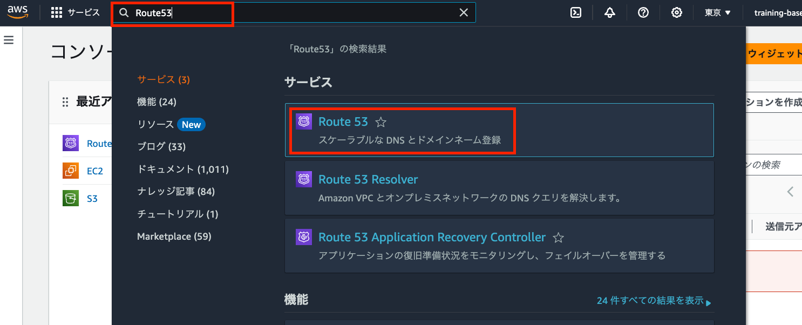
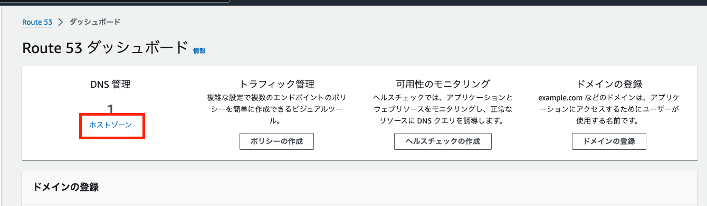
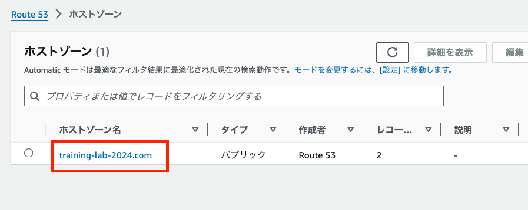
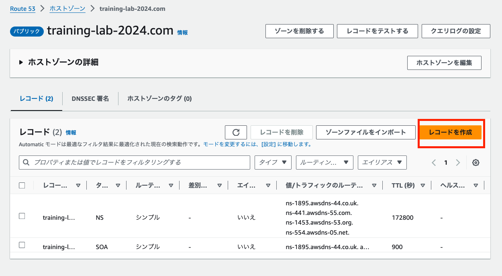
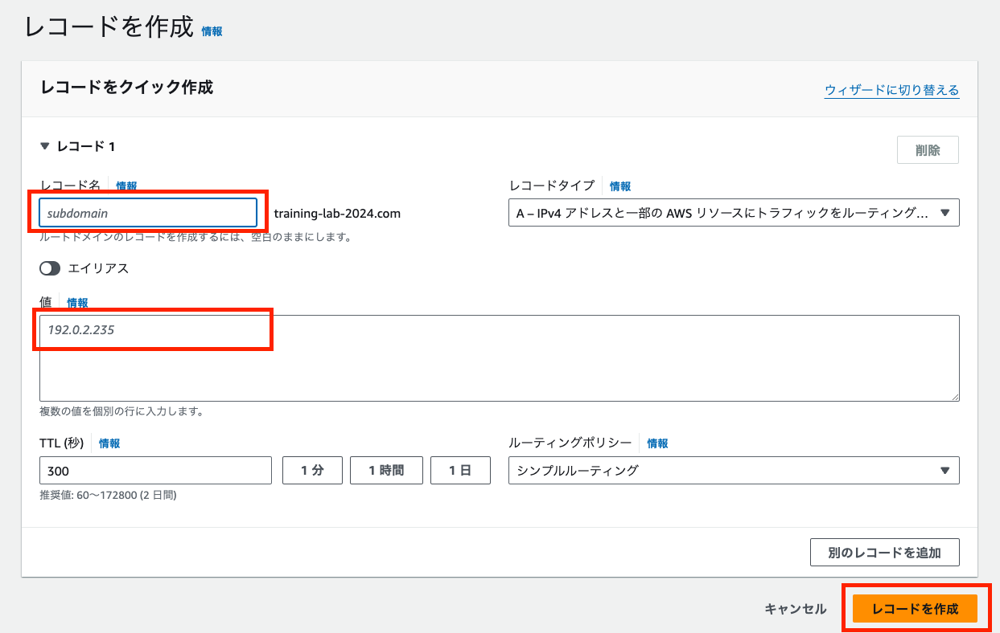
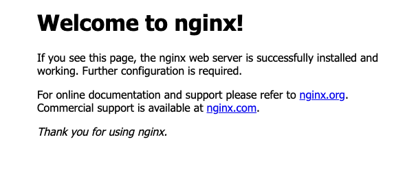

# Section 3. ドメイン設定

## Route53

検索バーに `Route53` を入力して開く。



ホストゾーンをクリック



ホストゾーン名をクリック




レコードを作成をクリック




レコード作成の画面を開いたら以下の3点を実行。

- サブドメインのレコード名は、 `{受講生名}-train` とする。
- 値の部分に、`パブリック IPv4 アドレス` を入力
- 最後に レコード作成ボタンをクリック




上記の操作後、`http://{受講生名}-train.training-lab-2024.com/` にアクセスをすると、以下のような画面になる。



これは、Nginxの設定に、ドメインの情報を設定していないためである。

## 設定ファイルの更新

### nginx.conf

nginx.conf の server_name の箇所を以下のように修正

▼ 修正前
```txt
server_name {パブリック IPv4 アドレス};
```

▼ 修正後
```txt
server_name {受講生名}-train.training-lab-2024.com;
```

### settings.py

settings.py の ALLOWED_HOSTS の箇所を以下のように修正

```py
ALLOWED_HOSTS = [
    'localhost',
    '{受講生名}.training-lab-2024.com',
]
```

### Gitにプッシュ

nginx.conf と settings.py をプッシュしておく

## 修正をEC2環境に反映

SSH接続
```sh
ssh -i ~/.ssh/{受講生名}-training-ec2-key.pem ec2-user@{パブリック IPv4 DNS}
```

aws-training-{受講生名} のディレクトリで、 git pull 実行。(ユーザー名とトークンを求められたら入力)
```sh
sudo git pull
```

myproject ディレクトリに移動
```sh
cd myproject
```

dockerを停止→再起動・ビルド
```sh
sudo docker-compose -f docker-compose-staging.yml down
sudo docker-compose -f docker-compose-staging.yml up --build -d
```


上記の操作後、`http://{受講生名}-train.training-lab-2024.com/` にアクセスし、サイトの画面が表示できればOK.

## 演習

- 課題
    - 本セクションの内容の手順に沿って、ステージング環境に、ドメインからアクセスできるようにしましょう。
- 前提
    - サブドメインのレコード名は、 `{受講生名}-stg` とする。
