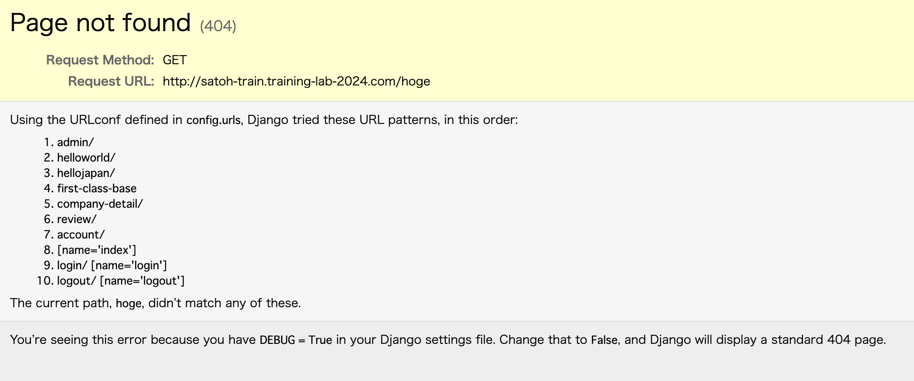
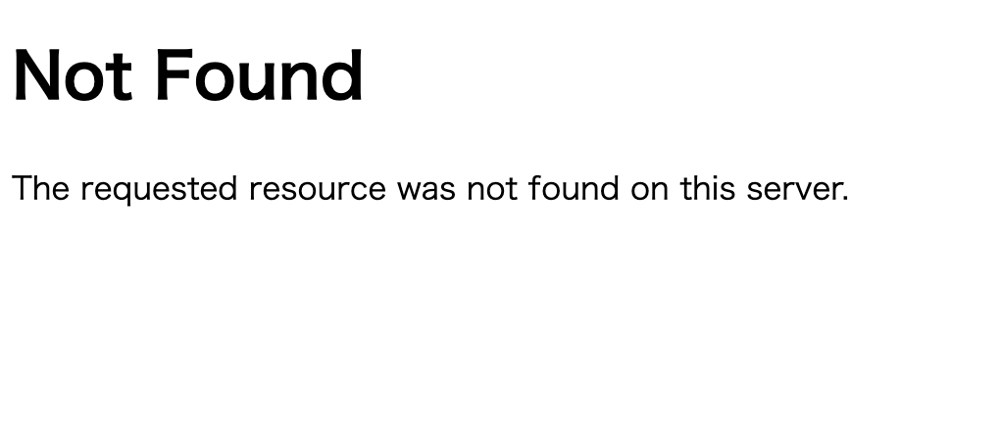

# Section 5. Debugモード解除

現状、EC2のサイトで存在しないパスにアクセスすると、以下のようにエラー画面が表示される。



ローカル開発環境では、このようなエラーが表示された方が良いが、公開されているサイトの場合は、様々な情報が記載されているエラー画面が表示されることは望ましくない。

今回は、環境変数を利用して、EC2環境では、エラー画面を表示しないようにする。

## ローカル開発環境での設定

### ローカル環境変数の作成

ローカル環境とEC2環境の違いを判定できるよう、`IS_LOCAL_ENV` という環境変数を作成していきます。

myproject 配下に、`.env` ファイルを作成し、以下のように環境変数を設定

```sh
# myproject ディレクトリにて実行
touch .env
```

```txt
ENV_NAME=local
```

※ .env ファイルは、.gitignore の対象なので、Git 管理の対象外

### settings.py

ローカルのsettings.py を以下のように修正して Git に push

settings.py の上部に、以下のコードを追加

```py
from dotenv import load_dotenv
load_dotenv()

# 環境変数を読み込み
ENV_NAME = os.getenv('ENV_NAME')
```

DEBUG の部分を以下のように、条件分岐させる

▼修正前
```py
DEBUG = True
```

▼修正後
```py
# ローカル環境の場合のみ、デバッグモードオン
if ENV_NAME == 'local':
    DEBUG = True
else:
    DEBUG = False
```

## ステージング開発環境での設定

### ssh 接続

ssh 接続
```sh
# ssh 接続
ssh -i ~/.ssh/{受講生名}-training-ec2-key.pem ec2-user@{パブリック IPv4 DNS}
```

### ステージング環境変数の作成

ステージング環境でも環境変数の設定をしてきます。

ステージング環境では、IS_LOCAL_ENV = False としておきましょう

```sh
# myproject ディレクトリに移動
cd myproject

# myproject ディレクトリにて実行
touch .env

# . で始まるファイルは隠しファイルなので、通常の ls では表示できない
ls

# 隠しファイルを含めて表示
ls -a
```

vim を使って、.env ファイルの中身を書き換えていきます。

1. vim で .env を開く

```sh
vim .env
```

3. vim内での操作
vimが開いたら、 `iキー` を押して挿入モードに入ります。挿入モードになったら、以下のコードを書きます。

```txt
ENV_NAME=staging

```

入力が終わったら、 `Escキー` を押して挿入モードを終了します。

`shift + :wq` と入力してエンターキーを押すことで、ファイルを保存してvimを終了します。

4. ファイルの変更の確認と実行

cat コマンドでファイルの中身を確認
```sh
cat .env
```

```txt
IS_LOCAL_ENV = False
```

### 改修したコードの反映

ssh 接続をして git pull
```sh
# aws-training-base ディレクトリに移動（cd .. で前の階層に戻る）
cd ..

# git pull
sudo git pull
```

myproject ディレクトリに移動
```sh
cd myproject
```

dockerを停止→再起動・ビルド
```sh
sudo docker-compose -f docker-compose-staging.yml down
sudo docker-compose -f docker-compose-staging.yml up --build -d
```

存在しないパスをブラウザの検索バーに入力し、以下のように表示されればOK



※ EC2 環境で、明示的に IS_LOCAL_ENV = True という環境変数を設定してもOK

※ 404エラーの画面をDjango側で設定することも可能

参考記事 : [Djangoでカスタマイズした404ページを表示する](https://djangobrothers.com/blogs/django_404_page/)

## 演習

- 課題
    - 各自のステージング環境も、デバッグモード解除できるよう設定しておきましょう。

