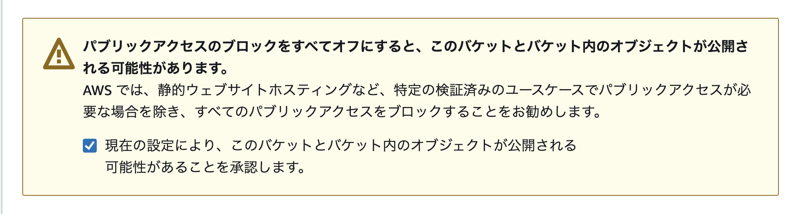

# Section 5: IAMとS3

## S3

### バケットを作成
検索バーからS3を開く


バケットを作成をクリック


バケット名を指定


チェックをすべて外す


チェックを入れる


作成したバケットを開く


### 権限の追加設定

アクセス許可タブをクリック


バケットポリシーの編集をクリック


以下のjsonを、バケット名を自分のものに変更して貼り付ける。

```json
{
    "Version": "2012-10-17",
    "Statement": [
        {
            "Sid": "PublicReadGetObject",
            "Effect": "Allow",
            "Principal": "*",
            "Action": "s3:GetObject",
            "Resource": "arn:aws:s3:::your-bucket/*"
        }
    ]
}
```


変更の保存をクリック

## IAM

検索バーからIAMを開く


サイドバーのメニューから ユーザー を選択し、自分のアカウントをクリック


セキュリティ認証情報タブを開く


アクセスキーを作成をクリック


`ローカルコード` と `上記のレコメンデーションを理解し、アクセスキーを作成します。` にチェックを入れて、次へボタンクリック


説明は任意だが、`satoh-bucket-access-key` などわかりやすいものを入力。
アクセスキー作成ボタンをクリック。


表示されたアクセスキーはメモするか、CSVダウンロードしておく。（注意：再表示はできない。）

## プログラムを作成

ローカル環境にて、以下のプログラムを作成しに git に push する

### 1. .env
今回はローカルでは挙動確認はしないが、環境変数を .env ファイルに設定する。

※変数の値は適宜自分のものに変更すること
```txt
AWS_ACCESS_KEY_ID=your_access_key_id
AWS_SECRET_ACCESS_KEY=your_secret_access_key
AWS_STORAGE_BUCKET_NAME=your_bucket_name
```

### 2. settings.py

settings.py の上の方に以下のコードを追加

```py
AWS_ACCESS_KEY_ID = os.getenv('AWS_ACCESS_KEY_ID')
AWS_SECRET_ACCESS_KEY = os.getenv('AWS_SECRET_ACCESS_KEY')
AWS_STORAGE_BUCKET_NAME = os.getenv('AWS_STORAGE_BUCKET_NAME')
AWS_S3_REGION_NAME = 'ap-northeast-1'  # 適切なリージョンを設定してください
AWS_S3_CUSTOM_DOMAIN = f'{AWS_STORAGE_BUCKET_NAME}.s3.amazonaws.com'
```

### 3. requirements.txt

requirements.txt に以下のライブラリを追加
```txt
boto3
```

### 4. S3アップロード用のビューの作成

#### confog/views.py

confog/views.py のインポートに以下を追加
```py
from django.conf import settings
import boto3
from botocore.exceptions import NoCredentialsError
from django.shortcuts import render
```

以下のクラスビューも追加
```py
class FileUploadView(TemplateView):
    template_name = "config/upload.html"

    def post(self, request, *args, **kwargs):
        file = request.FILES['file']
        s3 = boto3.client('s3', 
                          aws_access_key_id=settings.AWS_ACCESS_KEY_ID,
                          aws_secret_access_key=settings.AWS_SECRET_ACCESS_KEY,
                          region_name=settings.AWS_S3_REGION_NAME)
        
        content_type = file.content_type  # ファイルのContent-Typeを取得

        try:
            s3.upload_fileobj(
                file, 
                settings.AWS_STORAGE_BUCKET_NAME, 
                file.name,
                ExtraArgs={'ContentType': content_type}  # Content-Typeを指定
            )
            return render(request, self.template_name, {'success': True})
        except NoCredentialsError:
            return render(request, self.template_name, {'error': 'Credentials not available'})
```

#### templates/config/upload.html

htmlを作成

```sh
# myprojectディレクトリで実行
touch templates/config/upload.html
```

```html
<!DOCTYPE html>
<html>
<head>
    <title>Upload File</title>
</head>
<body>
    <h1>Upload File to S3</h1>
    
        <p>File uploaded successfully!</p>
    
        <p>Error: {{ error }}</p>
    
    <form method="post" enctype="multipart/form-data">
        
        <input type="file" name="file">
        <button type="submit">Upload</button>
    </form>
</body>
</html>
```

#### config/urls.py

FileUploadViewをインポート
```py
from .views import FileUploadView
```

urlpatternに追加
```py
path('upload/', FileUploadView.as_view(), name='file_upload'),
```

## ステージング環境

git pull をして最新のコードを反映

myproject ディレクトリに移動

```sh
cd myproject
```
.env ファイルに環境変数を追加

※変数の値は適宜自分のものに変更すること
```txt
AWS_ACCESS_KEY_ID=your_access_key_id
AWS_SECRET_ACCESS_KEY=your_secret_access_key
AWS_STORAGE_BUCKET_NAME=your_bucket_name
```

dockerを停止→再起動・ビルド
```sh
sudo docker-compose -f docker-compose-staging.yml down
sudo docker-compose -f docker-compose-staging.yml up --build -d
```

http://{受講生名}-train.training-lab-2024.com/upload にアクセスし、ファイルアップロードの挙動確認

ファイルが S3 の当該バケットに格納されていればOK